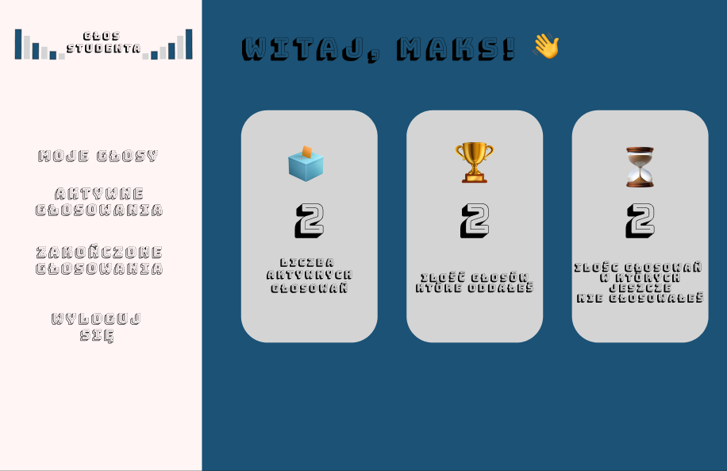
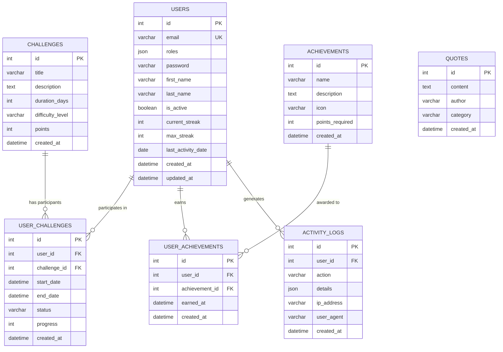

# 🧘 Cichy Challenge - Cyfrowy Detoks

Aplikacja webowa do cyfrowego detoksu - podejmuj wyzwania, buduj zdrowe nawyki i rywalizuj z innymi użytkownikami!



## ✨ Funkcjonalności

### 🎯 Wyzwania (Challenges)
- Przeglądaj dostępne wyzwania cyfrowego detoksu
- Dołączaj do wyzwań i śledź swoje postępy
- Ukończ wyzwanie aby zdobyć punkty
- Poziomy trudności: łatwy, średni, trudny

### 🔥 System Streak
- Buduj serię dni aktywności
- Codzienne meldowanie się (check-in)
- Rekord najdłuższej serii
- Nie przerwij serii - bądź konsekwentny!

### 🏆 Leaderboard (Ranking)
- TOP 10 użytkowników
- Medale dla najlepszych: 🥇🥈🥉
- Porównaj się z innymi
- Zdobywaj punkty i awansuj w rankingu

### 📊 Postępy
- Śledź swoje statystyki
- Aktywne wyzwania z paskiem postępu
- Zdobyte punkty i odznaki
- Motywujące cytaty

### 👑 Panel Admina
- Zarządzanie użytkownikami
- Statystyki aplikacji
- Logi aktywności

## 🛠️ Technologie

### Backend
- **PHP 8.3** z Symfony 7
- **Doctrine ORM** - obsługa bazy danych
- **JWT Authentication** - bezpieczna autoryzacja
- **PostgreSQL** - baza danych

### Frontend
- **Vue.js 3** z Composition API
- **TypeScript** - typowanie
- **Vue Router** - nawigacja SPA
- **Pinia** - zarządzanie stanem
- **Axios** - komunikacja z API

### DevOps
- **Docker** & Docker Compose
- **Nginx** - serwer HTTP
- **Hot Module Replacement** - szybki development

## 🚀 Instalacja

### Wymagania
- Docker & Docker Compose
- Git

### Uruchomienie

```bash
# Sklonuj repozytorium
git clone https://github.com/YOUR_USERNAME/cichy-challenge.git
cd cichy-challenge

# Uruchom kontenery Docker
docker compose up -d

# Zainstaluj zależności PHP
docker compose exec php composer install

# Wykonaj migracje bazy danych
docker compose exec php bin/console doctrine:migrations:migrate

# Załaduj przykładowe dane (opcjonalnie)
docker compose exec php bin/console doctrine:fixtures:load

# Zainstaluj zależności frontend
cd frontend && npm install && npm run dev
```

### Dostęp
- **Frontend:** http://localhost:5173
- **API:** http://localhost:8080/api

### Domyślne konta
- **Admin:** admin@example.com / password123
- **User:** user@example.com / password123

## 📁 Struktura projektu

```
cichy-challenge/
├── src/                    # Backend Symfony
│   ├── Controller/Api/     # Kontrolery REST API
│   ├── Entity/             # Encje Doctrine (User, Challenge, etc.)
│   └── Repository/         # Repozytoria
├── frontend/               # Frontend Vue.js
│   ├── src/views/          # Widoki (strony)
│   ├── src/stores/         # Pinia stores
│   └── src/router/         # Vue Router
├── migrations/             # Migracje bazy danych
├── docker/                 # Konfiguracja Docker
└── docker-compose.yml      # Orkiestracja kontenerów
```

## �️ Diagram ERD (Entity Relationship Diagram)



### Opis relacji:

| Relacja | Typ | Opis |
|---------|-----|------|
| Users → User_Challenges | 1:N | Użytkownik może uczestniczyć w wielu wyzwaniach |
| Challenges → User_Challenges | 1:N | Wyzwanie może mieć wielu uczestników |
| Users → User_Achievements | 1:N | Użytkownik może zdobyć wiele osiągnięć |
| Achievements → User_Achievements | 1:N | Osiągnięcie może być zdobyte przez wielu użytkowników |
| Users → Activity_Logs | 1:N | Użytkownik generuje wiele logów aktywności |

## �🔌 API Endpoints

### Autoryzacja
- `POST /api/auth/register` - Rejestracja
- `POST /api/auth/login` - Logowanie

### Wyzwania
- `GET /api/challenges` - Lista wyzwań
- `POST /api/challenges/{id}/join` - Dołącz do wyzwania
- `POST /api/challenges/{id}/leave` - Opuść wyzwanie
- `POST /api/challenges/{id}/complete` - Ukończ wyzwanie

### Ranking & Streak
- `GET /api/leaderboard` - TOP 10 + twoje statystyki
- `GET /api/leaderboard/streak` - Dane streak
- `POST /api/leaderboard/checkin` - Dzienny check-in

### Postępy
- `GET /api/progress` - Twoje postępy

## 🎨 Screenshots

### Strona wyzwań
Lista dostępnych wyzwań z możliwością dołączenia.

### Ranking
TOP 10 użytkowników z medalami i statystykami streak.

### Postępy
Twoje aktywne wyzwania i statystyki.

## 👨‍💻 Autor

Projekt stworzony jako część nauki full-stack development.

## 📄 Licencja

MIT License - używaj jak chcesz! 🚀
